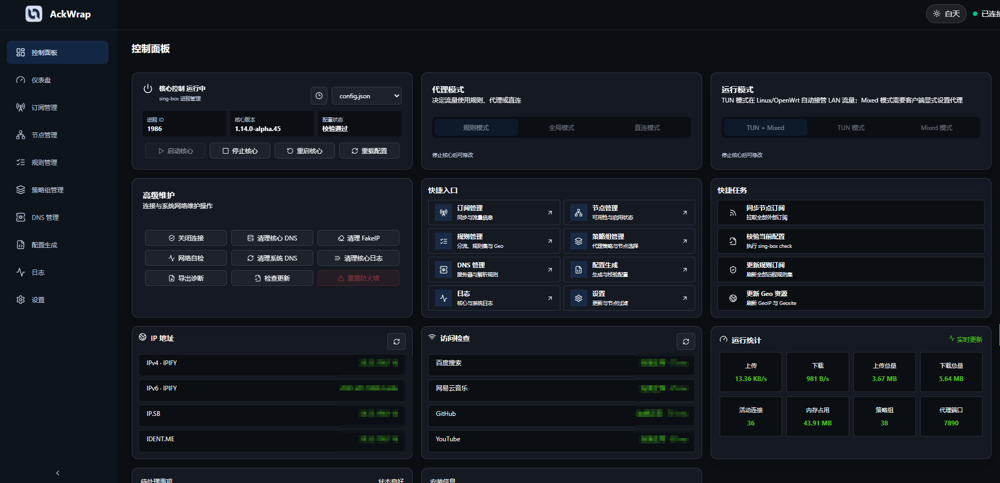
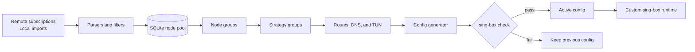

<p align="center">
  
</p>

<h1 align="center">Ackwrap</h1>

<p align="center">
  <strong>A local-first control plane for sing-box.</strong><br>
  Turn subscriptions, nodes, policies, DNS, and routes into a validated runtime configuration.
</p>

<p align="center">
  <a href="https://github.com/ackwrap/ackrun/releases/latest"></a>
  <a href="./LICENSE"></a>
  
  
</p>

<p align="center">
  <a href="#download">Download</a> &middot;
  <a href="#features">Features</a> &middot;
  <a href="#how-it-works">How it works</a> &middot;
  <a href="#development">Development</a> &middot;
  <a href="./README.zh-CN.md">简体中文</a>
</p>

<p align="center">
  <a href="./image/preview.png"></a>
</p>

<p align="center"><sub>Core control, policy modes, health checks, traffic, and maintenance in one dashboard.</sub></p>

> [!WARNING]
> `v0.0.1` is the first public test release. Back up your data and configuration before upgrading. Breaking database, configuration, and runtime changes may occur before the first stable release.

## Why Ackwrap

sing-box is powerful, but a production-sized JSON configuration is not pleasant to operate by hand. Ackwrap puts the full configuration lifecycle behind one focused web console:

| | |
|---|---|
| **One node pipeline** | Parse remote subscriptions and local imports, apply filters, preserve node identity, and manage availability in one place. |
| **Policy without JSON wrestling** | Build selector, URLTest, and fallback strategies from dynamic node groups and route rules. |
| **Safer configuration changes** | Generate into a temporary file and run `sing-box check` before replacing the active configuration. |
| **Runtime visibility** | Inspect core state, logs, connections, traffic, synchronization progress, and failures from the browser. |
| **OpenWrt-native packaging** | A single IPK includes the service, procd integration, LuCI entry, and iStoreOS metadata. |
| **Local by design** | SQLite and cache files stay on your device. No cloud account or external database is required. |

## Features

- **Subscriptions**: remote sources, local/manual imports, scheduled synchronization, custom User-Agent, and sync failure reporting.
- **Nodes**: Clash YAML, sing-box JSON, base64 URI lists, plain URI lists, filters, stable UIDs, flags, latency checks, batch rename, and enable/prefer controls.
- **Groups and strategies**: dynamic subscription/protocol filters, manual membership, selector, URLTest, fallback, and strategy health checks.
- **Routing**: manual rules, rule subscriptions, GeoIP/GeoSite assets, Clash rule-provider conversion, priority ordering, and generated previews.
- **DNS and TUN**: DNS servers, real-IP rules, FakeIP, leak protection, inbound modes, and traffic bypass rules.
- **Configuration**: modular preview, complete JSON preview, validation, backup, restore, apply, reload, and process/direct-loop protection.
- **Operations**: core lifecycle control, WebSocket events, logs, connections, traffic, diagnostics, and update checks.
- **Custom runtime**: integration with [ackwrap/sing-box-wrap](https://github.com/ackwrap/sing-box-wrap), including Ackwrap-specific VLESS encryption support.

## How It Works



Ackwrap keeps the browser thin and the backend authoritative. Parsing, filtering, synchronization, persistence, config generation, validation, and runtime control all happen in the Go service. REST triggers actions; WebSocket events report progress and final state.

## Download

The current public test release is [`v0.0.1`](https://github.com/ackwrap/ackrun/releases/tag/v0.0.1).

| Artifact | Target | Download |
|---|---|---|
| Combined IPK | OpenWrt x86_64 | [`ackwrap_0.0.1-1_x86_64.ipk`](https://github.com/ackwrap/ackrun/releases/download/v0.0.1/ackwrap_0.0.1-1_x86_64.ipk) |
| Standalone binary | OpenWrt amd64 | [`ackwrap-openwrt-amd64`](https://github.com/ackwrap/ackrun/releases/download/v0.0.1/ackwrap-openwrt-amd64) |

### OpenWrt Quick Install

```bash
scp ackwrap_0.0.1-1_x86_64.ipk root@ROUTER_IP:/tmp/
ssh root@ROUTER_IP
opkg install /tmp/ackwrap_0.0.1-1_x86_64.ipk
```

After installation, open **LuCI > Services > Ackwrap** and use the launch button to establish an authenticated Ackwrap session.

> [!NOTE]
> The published `v0.0.1` package currently targets OpenWrt x86_64. Other targets can be built from source.

## Architecture

```text
Browser
  Vue 3 + TypeScript + Vite
              |
       REST + WebSocket
              |
Go service (Gin)
  handlers -> services -> stores -> SQLite
                  |
          config generator
                  |
           sing-box check
                  |
      custom sing-box runtime
```

| Layer | Technology |
|---|---|
| Backend | Go, Gin, modernc SQLite, Gorilla WebSocket, robfig/cron |
| Frontend | Vue 3, TypeScript, Vite, Vue Router, Tailwind CSS 4, DaisyUI |
| Runtime | sing-box-compatible JSON with an Ackwrap-maintained custom core |
| Storage | Local SQLite database plus filesystem caches |
| OpenWrt | procd, UCI, LuCI, and iStoreOS app metadata |

## Development

### Validate

```bash
cd backend
go build ./...
go test ./...
go vet ./...

cd ../frontend
npm run build
```

### Run Locally

```bash
# Terminal 1
cd backend
ACKWRAP_LISTEN_ADDR=127.0.0.1:8080 go run ./cmd/server

# Terminal 2
cd frontend
npm run dev
```

The frontend development server runs on `http://127.0.0.1:5173` and proxies API requests to the backend on port `8080`.

### Build Release Artifacts

```bash
# Windows, Linux, and OpenWrt amd64
python build.py

# OpenWrt arm64 binary and combined IPK
python build.py --target openwrt --arch arm64
```

The frontend is embedded into the Go binary. OpenWrt source templates live under `openwrt/`, and generated artifacts are written to `dist/`.

## Project Layout

```text
backend/          Go API, business services, persistence, parsers, and embedded UI
frontend/         Vue web console
openwrt/          UCI, procd, LuCI, iStoreOS, and package control files
docs/             Architecture, API, database, deployment, and test documentation
sing-box-wrap/    Ackwrap-maintained sing-box submodule
```

<details>
<summary><strong>Upstream projects and references</strong></summary>

- [SagerNet/sing-box](https://github.com/SagerNet/sing-box) - runtime and configuration model
- [MetaCubeX/mihomo](https://github.com/MetaCubeX/mihomo) - protocol behavior and Clash compatibility reference
- [MetaCubeX/metacubexd](https://github.com/MetaCubeX/metacubexd) - dashboard interaction reference
- [SagerNet/sing-geoip](https://github.com/SagerNet/sing-geoip) and [sing-geosite](https://github.com/SagerNet/sing-geosite) - Geo databases
- [XTLS/Xray-core](https://github.com/XTLS/Xray-core) - VLESS and Reality ecosystem reference

</details>

## License

Ackwrap is released under the [MIT License](./LICENSE). Third-party code and assets remain under their original licenses.
