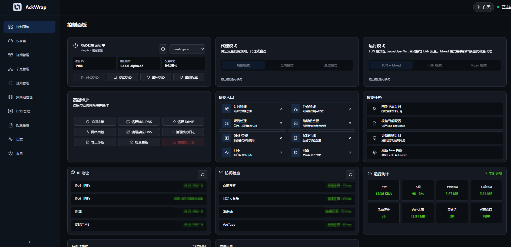
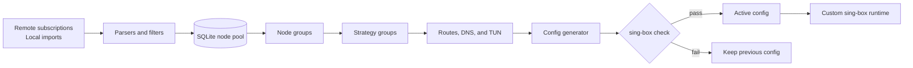
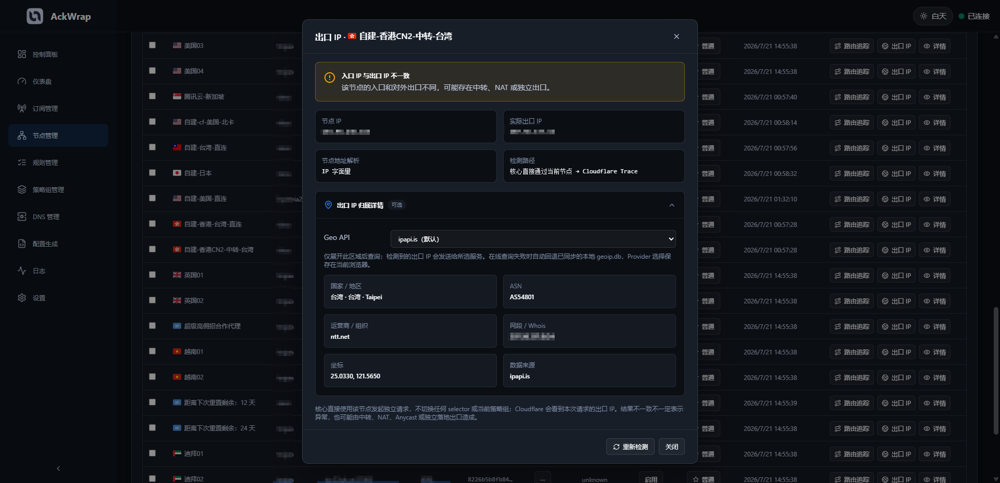
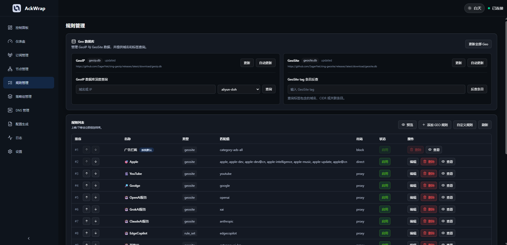
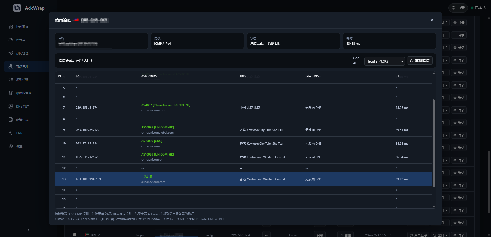

<p align="center">
  
</p>

<h1 align="center">Ackwrap</h1>

<p align="center">
  <strong>A local-first control plane for sing-box.</strong><br>
  Turn subscriptions, nodes, policies, DNS, and routes into a validated runtime configuration.
</p>

<p align="center">
  <a href="https://github.com/ackwrap/ackrun/releases/latest"></a>
  <a href="./LICENSE"></a>
  
  
</p>

<p align="center">
  <a href="#download">Download</a> &middot;
  <a href="#features">Features</a> &middot;
  <a href="#how-it-works">How it works</a> &middot;
  <a href="#development">Development</a> &middot;
  <a href="./README.zh-CN.md">简体中文</a>
</p>

<p align="center">
  <a href="./image/preview.png"></a>
</p>

<p align="center"><sub>Core control, policy modes, health checks, traffic, and maintenance in one dashboard.</sub></p>

## Why Ackwrap

sing-box is powerful, but a production-sized JSON configuration is not pleasant to operate by hand. Ackwrap puts the full configuration lifecycle behind one focused web console:

| | |
|---|---|
| **One node pipeline** | Parse remote subscriptions and local imports, apply filters, preserve node identity, and manage availability in one place. |
| **Policy without JSON wrestling** | Build selector, URLTest, and fallback strategies from dynamic node groups and route rules. |
| **Safer configuration changes** | Generate into a temporary file and run `sing-box check` before replacing the active configuration. |
| **Runtime visibility** | Inspect core state, logs, connections, traffic, synchronization progress, and failures from the browser. |
| **OpenWrt-native packaging** | A single IPK includes the service, procd integration, LuCI entry, and iStoreOS metadata. |
| **Local by design** | SQLite and cache files stay on your device. No cloud account or external database is required. |

## Features

- **Subscriptions**: remote sources, local/manual imports, scheduled synchronization, custom User-Agent, and sync failure reporting.
- **Nodes**: Clash YAML, sing-box JSON, base64 URI lists, plain URI lists, filters, stable UIDs, flags, latency checks, batch rename, and enable/prefer controls.
- **Groups and strategies**: dynamic subscription/protocol filters, manual membership, selector, URLTest, fallback, and strategy health checks.
- **Routing**: manual rules, rule subscriptions, GeoIP/GeoSite assets, Clash rule-provider conversion, priority ordering, and generated previews.
- **DNS and TUN**: DNS servers, real-IP rules, FakeIP, leak protection, inbound modes, and traffic bypass rules.
- **Configuration**: modular preview, complete JSON preview, validation, backup, restore, apply, reload, and process/direct-loop protection.
- **Operations**: core lifecycle control, WebSocket events, logs, connections, traffic, diagnostics, and update checks.
- **Custom runtime**: integration with [ackwrap/sing-box-wrap](https://github.com/ackwrap/sing-box-wrap), including Ackwrap-specific VLESS encryption support.

## SSH MCP over HTTP

Open **SSH Hosts > MCP Configuration** to enable the built-in MCP service and generate a dedicated token. No separate ssh-mcp2 process is required. The endpoint is `/mcp/ssh` on Ackwrap's existing HTTP port. A client configuration looks like:

```json
{
  "mcpServers": {
    "ackwrap-ssh": {
      "url": "http://192.168.1.1:8080/mcp/ssh",
      "headers": { "Authorization": "Bearer <MCP_TOKEN>" }
    }
  }
}
```

Replace the example address with Ackwrap's LAN IP. The page can copy the complete configuration when a token is generated; later visits show a template. Only a token hash is stored. Token rotation rejects the previous token on subsequent requests, and disabling MCP rejects new requests. Already running operations may finish within their timeout.

The service is disabled by default. Each request requires the dedicated MCP bearer token, including requests from localhost. The management API token and browser cookies cannot authenticate MCP requests. Direct peers must use loopback, private IPv4/IPv6, or link-local addresses; public peers, public/domain Host headers, foreign Origins, query parameters and forwarded requests are rejected. Use the LAN IP directly. HTTP provides no transport encryption, so use this endpoint only on a trusted LAN; do not forward it through a public proxy or router port mapping.

Available tools: `ssh_list_servers`, `ssh_list_credentials` (metadata only), `ssh_add_server`, `ssh_update_server`, `ssh_delete_server`, `ssh_test_connection`, `ssh_exec`, `ssh_exec_multi`, `ssh_read_file`, `ssh_write_file`, `ssh_upload`, `ssh_download`, `ssh_list_dir`, and `ssh_stat`. Hosts are addressed by `host_id`, and host creation references an existing `credential_id`. Host updates take a complete `config` object. Jump chains from ssh-mcp2 are not imported; Ackwrap's saved direct or node-exposure connection paths and Host Key verification remain authoritative. Confirm unknown or changed Host Keys in the host page.

Command timeout defaults to 30 seconds (maximum 600), with stdout and stderr each capped at 1 MiB and truncation reported. Batch execution accepts up to 10 hosts. Directory results return at most 1000 entries and indicate truncation. Operation logs record tool names, host IDs and results without command text, file content or credentials.

Large files stream between HTTP and SFTP with no total file-size cap, a bounded copy buffer, and no intermediate file on Ackwrap. Transfers have a one-hour timeout and share SSH session limits; disk space and client timeouts still apply. The 2 MiB MCP JSON request limit applies to control messages only. UTF-8 `ssh_read_file` / `ssh_write_file` and legacy inline Base64 remain limited to 1 MiB.

- `ssh_upload` with `host_id`, remote `path`, and `source_url` downloads an HTTP(S) source directly into SFTP. The MCP token is never forwarded to that source. Optional `sha256` verifies the completed upload.
- For a file on the AI client's computer, call `ssh_upload` with `host_id` and `path` to obtain `method`, `endpoint_path`, and headers, then stream the file using a local HTTP/file tool. A `status: ready` result means no bytes have been transferred yet. Ackwrap cannot open a Windows/local path on the client's computer.
- `ssh_download` returns the corresponding HTTP GET descriptor. Save that response with a local HTTP/file tool. `inline: true` retains the small-file Base64 response; upload's legacy `content` accepts small Base64 files only.

The transfer endpoint is `PUT` / `GET /mcp/ssh/files/<host_id>` on the same origin as MCP. Both require the same MCP Bearer token and LAN restrictions, with the remote path in `X-SSH-Path`. Upload accepts `X-SSH-Overwrite: true` and optional `X-SSH-SHA256`. Send raw file bytes, not JSON or multipart form data; chunked uploads without Content-Length are supported. For example, with the token already in `MCP_TOKEN`:

```sh
curl --fail-with-body -H "Authorization: Bearer $MCP_TOKEN" -H "X-SSH-Path: /tmp/package.ipk" --upload-file ./package.ipk http://192.168.1.1:8080/mcp/ssh/files/1
curl --fail -H "Authorization: Bearer $MCP_TOKEN" -H "X-SSH-Path: /tmp/package.ipk" --output ./package.ipk http://192.168.1.1:8080/mcp/ssh/files/1
```

Uploads write a remote temporary file, verify the received length when provided and optional SHA-256, then publish it. Failure before publication preserves the destination. Replacement requires `overwrite: true` and SFTP `posix-rename@openssh.com`; creating without overwrite requires `hardlink@openssh.com` to avoid overwriting a concurrently created file. Unsupported servers fail before file data is read. Temporary files are removed on failure when the SSH connection remains available; a broken connection may leave a hidden `.ackwrap-mcp-*` file in the destination directory. Upload success returns byte count and SHA-256; interrupted downloads fail with an incomplete HTTP body.

## How It Works


```mermaid
flowchart LR
    A[Remote subscriptions<br/>Local imports] --> B[Parsers and filters]
    B --> C[(SQLite node pool)]
    C --> D[Node groups]
    D --> E[Strategy groups]
    E --> F[Routes, DNS, and TUN]
    F --> G[Config generator]
    G --> H{sing-box check}
    H -->|pass| I[Active config]
    H -->|fail| J[Keep previous config]
    I --> K[Custom sing-box runtime]
```

Ackwrap keeps the browser thin and the backend authoritative. Parsing, filtering, synchronization, persistence, config generation, validation, and runtime control all happen in the Go service. REST triggers actions; WebSocket events report progress and final state.

## Download

Download the latest build from [GitHub Releases](https://github.com/ackwrap/ackrun/releases/latest).

| Artifact | Target | Filename |
|---|---|---|
| Combined IPK | OpenWrt x86_64 | `ackwrap_VERSION-1_x86_64.ipk` |
| Standalone binary | OpenWrt amd64 | `ackwrap-openwrt-amd64` |
| Combined IPK | OpenWrt ARM64 | `ackwrap_VERSION-1_aarch64_generic.ipk` |
| Standalone binary | OpenWrt arm64 | `ackwrap-openwrt-arm64` |

### OpenWrt Quick Install

```bash
scp ackwrap_VERSION-1_x86_64.ipk root@ROUTER_IP:/tmp/ackwrap.ipk
ssh root@ROUTER_IP 'opkg install /tmp/ackwrap.ipk'
```

After installation, open **LuCI > Services > Ackwrap** and use the launch button to establish an authenticated Ackwrap session.

Use the `x86_64` IPK for amd64 routers and `aarch64_generic` for arm64 routers.

## Architecture

```text
Browser
  Vue 3 + TypeScript + Vite
              |
       REST + WebSocket
              |
Go service (Gin)
  handlers -> services -> stores -> SQLite
                  |
          config generator
                  |
           sing-box check
                  |
      custom sing-box runtime
```

| Layer | Technology |
|---|---|
| Backend | Go, Gin, modernc SQLite, Gorilla WebSocket, robfig/cron |
| Frontend | Vue 3, TypeScript, Vite, Vue Router, Tailwind CSS 4, DaisyUI |
| Runtime | sing-box-compatible JSON with an Ackwrap-maintained custom core |
| Storage | Local SQLite database plus filesystem caches |
| OpenWrt | procd, UCI, LuCI, and iStoreOS app metadata |

## Development

### Validate

```bash
cd backend
go build ./...
go test ./...
go vet ./...

cd ../frontend
npm run build
```

### Run Locally

```bash
# Terminal 1
cd backend
ACKWRAP_LISTEN_ADDR=127.0.0.1:8080 go run ./cmd/server

# Terminal 2
cd frontend
npm run dev
```

The frontend development server runs on `http://127.0.0.1:5173` and proxies API requests to the backend on port `8080`.

### Build Release Artifacts

```bash
# Windows, Linux, and OpenWrt amd64
python build.py

# OpenWrt arm64 binary and combined IPK
python build.py --target openwrt --arch arm64
```

The frontend is embedded into the Go binary. OpenWrt source templates live under `openwrt/`, and generated artifacts are written to `dist/`.

## Project Layout

```text
backend/          Go API, business services, persistence, parsers, and embedded UI
frontend/         Vue web console
openwrt/          UCI, procd, LuCI, iStoreOS, and package control files
sing-box-wrap/    Ackwrap-maintained sing-box submodule
```

<details>
<summary><strong>Upstream projects and references</strong></summary>

- [SagerNet/sing-box](https://github.com/SagerNet/sing-box) - runtime and configuration model
- [MetaCubeX/mihomo](https://github.com/MetaCubeX/mihomo) - protocol behavior and Clash compatibility reference
- [MetaCubeX/metacubexd](https://github.com/MetaCubeX/metacubexd) - dashboard interaction reference
- [SagerNet/sing-geoip](https://github.com/SagerNet/sing-geoip) and [sing-geosite](https://github.com/SagerNet/sing-geosite) - Geo databases
- [XTLS/Xray-core](https://github.com/XTLS/Xray-core) - VLESS and Reality ecosystem reference

</details>

## Interface Preview

<table>
  <tr>
    <td width="50%" align="center">
      <a href="./image/ip.png"></a><br>
      <sub>IP intelligence and connectivity checks</sub>
    </td>
    <td width="50%" align="center">
      <a href="./image/rules.png"></a><br>
      <sub>Routing rules and rule subscriptions</sub>
    </td>
  </tr>
  <tr>
    <td colspan="2" align="center">
      <a href="./image/traceroute.png"></a><br>
      <sub>Visual route tracing</sub>
    </td>
  </tr>
</table>

## License

Ackwrap is released under the [MIT License](./LICENSE). Third-party code and assets remain under their original licenses.
