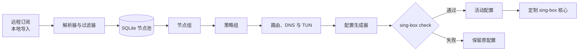

<p align="center">
  
</p>

<h1 align="center">Ackwrap</h1>

<p align="center">
  <strong>本地优先的 sing-box 控制平面。</strong><br>
  把订阅、节点、策略、DNS 和路由，变成经过校验的运行配置。
</p>

<p align="center">
  <a href="https://github.com/ackwrap/ackrun/releases/latest"></a>
  <a href="./LICENSE"></a>
  
  
</p>

<p align="center">
  <a href="#下载">下载</a> &middot;
  <a href="#功能">功能</a> &middot;
  <a href="#工作流程">工作流程</a> &middot;
  <a href="#开发">开发</a> &middot;
  <a href="./README.md">English</a>
</p>

<p align="center">
  <a href="./image/preview.png"></a>
</p>

<p align="center"><sub>在一张面板中完成核心控制、模式切换、访问检查、流量观察和高级维护。</sub></p>

> [!WARNING]
> `v0.0.1` 是首个公开测试版。升级前请备份数据和配置；首个稳定版发布前，数据库、配置格式和运行行为都可能发生不兼容变更。

## 为什么选择 Ackwrap

sing-box 很强大，但大型 JSON 配置并不适合长期手工维护。Ackwrap 用一个专注的 Web 控制台管理完整配置生命周期：

| | |
|---|---|
| **统一节点流水线** | 解析远程订阅与本地导入，应用过滤规则，保持节点身份稳定，并集中管理节点可用性。 |
| **不用手搓 JSON 的策略管理** | 从动态节点组和路由规则构建 selector、URLTest、fallback 策略。 |
| **更安全的配置变更** | 先生成临时文件并执行 `sing-box check`，通过后才替换活动配置。 |
| **可见的运行状态** | 在浏览器中查看核心状态、日志、连接、流量、同步进度和失败原因。 |
| **OpenWrt 原生打包** | 单个 IPK 集成服务、procd、LuCI 入口和 iStoreOS 元数据。 |
| **数据留在本机** | SQLite 数据库和缓存都保存在设备上，无需云端账号或外部数据库。 |

## 功能

- **订阅管理**：远程订阅、本地/手动导入、定时同步、自定义 User-Agent 和同步失败提示。
- **节点管理**：Clash YAML、sing-box JSON、base64 URI、纯 URI、过滤规则、稳定 UID、地区标识、延迟测试、批量重命名和启用/优选控制。
- **节点组与策略组**：动态订阅/协议过滤、手工成员、selector、URLTest、fallback 和策略健康检查。
- **路由管理**：手动规则、规则订阅、GeoIP/GeoSite、Clash rule-provider 转换、优先级排序和生成预览。
- **DNS 与 TUN**：DNS Server、真实 IP 规则、FakeIP、防泄漏、入站模式和流量排除规则。
- **配置管理**：模块预览、完整 JSON 预览、校验、备份、恢复、应用、重载和进程/节点防回环。
- **运行维护**：核心生命周期、WebSocket 事件、日志、连接、流量、诊断和更新检查。
- **定制核心**：集成 [ackwrap/sing-box-wrap](https://github.com/ackwrap/sing-box-wrap)，支持 Ackwrap 特定改动，例如 VLESS encryption。

## 工作流程



Ackwrap 保持前端轻量、后端权威。解析、过滤、同步、持久化、配置生成、校验和核心控制全部在 Go 服务中完成；REST API 触发动作，WebSocket 返回过程与最终状态。

## 下载

当前公开测试版为 [`v0.0.1`](https://github.com/ackwrap/ackrun/releases/tag/v0.0.1)。

| 产物 | 目标平台 | 下载 |
|---|---|---|
| 整合 IPK | OpenWrt x86_64 | [`ackwrap_0.0.1-1_x86_64.ipk`](https://github.com/ackwrap/ackrun/releases/download/v0.0.1/ackwrap_0.0.1-1_x86_64.ipk) |
| 独立二进制 | OpenWrt amd64 | [`ackwrap-openwrt-amd64`](https://github.com/ackwrap/ackrun/releases/download/v0.0.1/ackwrap-openwrt-amd64) |

### OpenWrt 快速安装

```bash
scp ackwrap_0.0.1-1_x86_64.ipk root@ROUTER_IP:/tmp/
ssh root@ROUTER_IP
opkg install /tmp/ackwrap_0.0.1-1_x86_64.ipk
```

安装完成后，打开 **LuCI > 服务 > Ackwrap**，通过启动按钮进入已认证的 Ackwrap 会话。

> [!NOTE]
> 已发布的 `v0.0.1` 安装包目前只面向 OpenWrt x86_64；其他平台可从源码构建。

## 架构

```text
浏览器
  Vue 3 + TypeScript + Vite
              |
       REST + WebSocket
              |
Go 服务（Gin）
  handler -> service -> store -> SQLite
                  |
             配置生成器
                  |
           sing-box check
                  |
          定制 sing-box 核心
```

| 层级 | 技术 |
|---|---|
| 后端 | Go、Gin、modernc SQLite、Gorilla WebSocket、robfig/cron |
| 前端 | Vue 3、TypeScript、Vite、Vue Router、Tailwind CSS 4、DaisyUI |
| 运行核心 | sing-box 兼容 JSON 配置与 Ackwrap 维护的定制核心 |
| 存储 | 本地 SQLite 数据库和文件缓存 |
| OpenWrt | procd、UCI、LuCI 和 iStoreOS app-meta |

## 开发

### 验证

```bash
cd backend
go build ./...
go test ./...
go vet ./...

cd ../frontend
npm run build
```

### 本地运行

```bash
# 终端 1
cd backend
ACKWRAP_LISTEN_ADDR=127.0.0.1:8080 go run ./cmd/server

# 终端 2
cd frontend
npm run dev
```

前端开发服务器运行在 `http://127.0.0.1:5173`，API 请求自动代理到后端 `8080` 端口。

### 构建发布产物

```bash
# Windows、Linux 和 OpenWrt amd64
python build.py

# OpenWrt arm64 二进制和整合 IPK
python build.py --target openwrt --arch arm64
```

前端构建结果会嵌入 Go 二进制。OpenWrt 源模板位于 `openwrt/`，生成的发布产物位于 `dist/`。

## 目录结构

```text
backend/          Go API、业务服务、持久化、解析器和嵌入式前端
frontend/         Vue Web 控制台
openwrt/          UCI、procd、LuCI、iStoreOS 和软件包控制文件
docs/             架构、API、数据库、部署和测试文档
sing-box-wrap/    Ackwrap 维护的 sing-box 子模块
```

<details>
<summary><strong>上游项目与参考来源</strong></summary>

- [SagerNet/sing-box](https://github.com/SagerNet/sing-box) - 运行核心与配置模型
- [MetaCubeX/mihomo](https://github.com/MetaCubeX/mihomo) - 协议行为与 Clash 兼容参考
- [MetaCubeX/metacubexd](https://github.com/MetaCubeX/metacubexd) - 控制台交互参考
- [SagerNet/sing-geoip](https://github.com/SagerNet/sing-geoip) 与 [sing-geosite](https://github.com/SagerNet/sing-geosite) - Geo 数据库
- [XTLS/Xray-core](https://github.com/XTLS/Xray-core) - VLESS 与 Reality 生态参考

</details>

## 许可证

Ackwrap 使用 [MIT License](./LICENSE) 发布。第三方代码与资源仍遵循其原始许可证。
